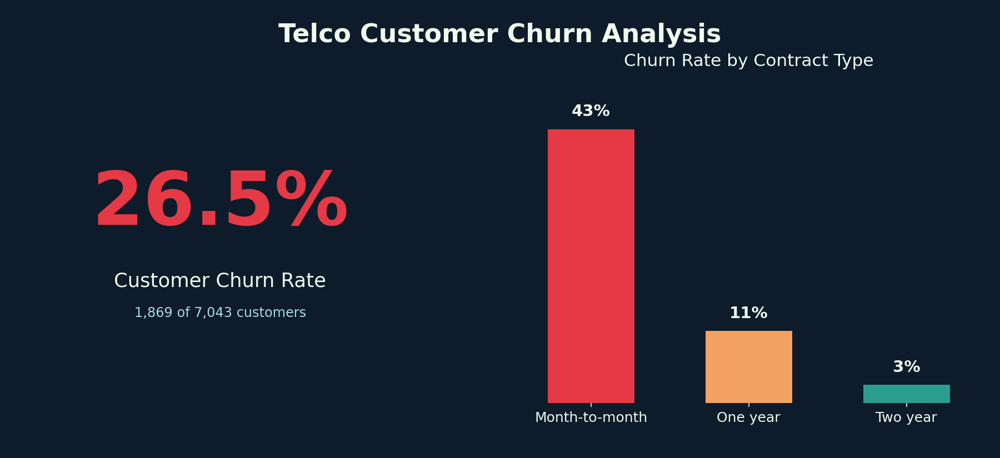
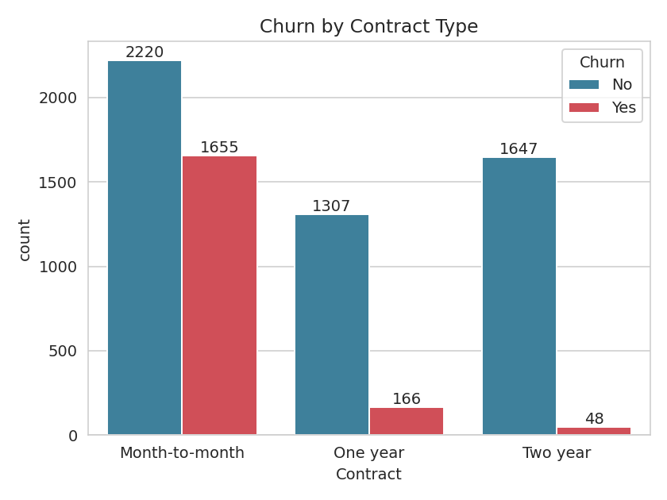
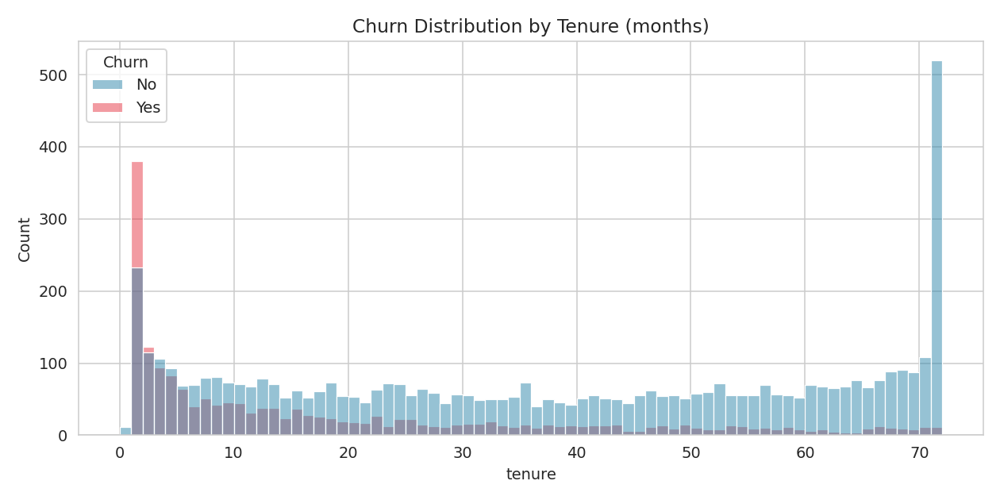
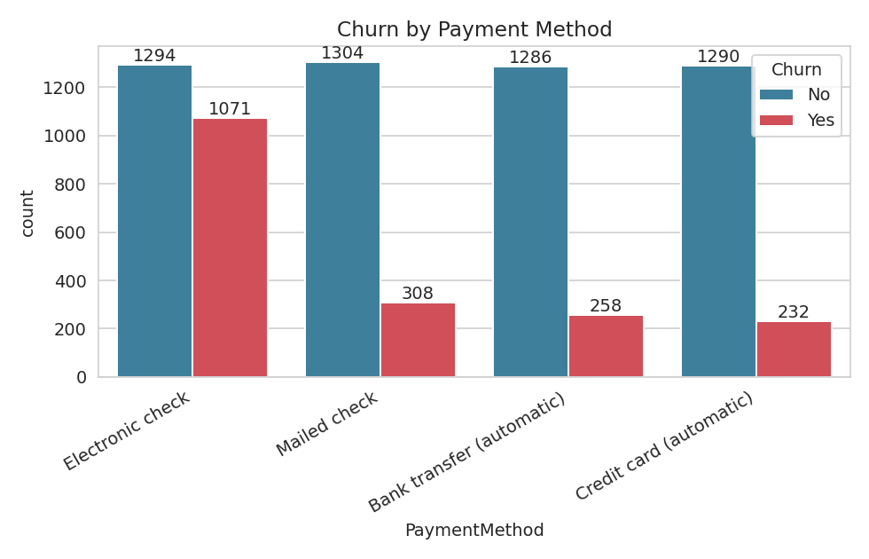
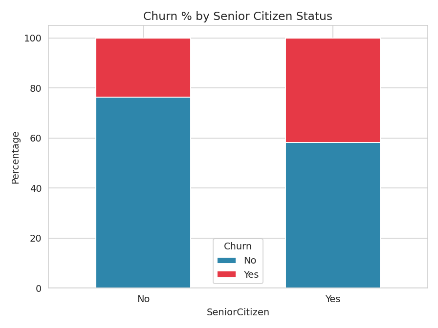

# 📉 Telco Customer Churn Analysis

An exploratory data analysis (EDA) project that investigates **why customers leave a telecom company** and what business actions could reduce churn. The analysis uses Python (Pandas, Matplotlib, Seaborn) inside a Jupyter Notebook, and closes with a summary report of insights and recommendations.



---

## 📌 Project Overview

Customer churn — when a customer stops doing business with a company — is one of the most expensive problems in the telecom industry. This project analyzes a dataset of **7,043 telecom customers** to uncover the key drivers of churn, including contract type, tenure, payment method, and add-on services, and translates those findings into actionable retention recommendations.

**Overall churn rate: 26.54%** of customers in the dataset have churned.

---

## ❓ Questions This Analysis Answers

1. What percentage of customers have churned overall?
2. Does gender have any relationship with churn?
3. Are senior citizens more likely to churn than younger customers?
4. How does tenure (how long a customer has stayed) affect churn?
5. Which contract type (month-to-month, one year, two year) has the highest churn?
6. Do add-on services (online security, tech support, streaming, etc.) influence churn?
7. Which payment method is associated with the highest churn rate?
8. What actions can the business take to reduce churn?

---

## 🗂️ Repository Structure

```
Customer-Churn-Insights/
├── Customer_Data.csv                    # Raw dataset (7,043 rows, 21 columns)
├── TCA.ipynb                            # Jupyter notebook with full EDA & visualizations
├── Teco Customer Churn Analysys.pdf     # Summary report: key insights & recommendations
├── images/                              # Charts used in this README
└── README.md                            # Project documentation (this file)
```

---

## 📊 Dataset

The dataset (`Customer_Data.csv`) contains **7,043 customer records** with **21 columns**, including:

| Category | Columns |
|---|---|
| **Demographics** | `gender`, `SeniorCitizen`, `Partner`, `Dependents` |
| **Account Info** | `tenure`, `Contract`, `PaperlessBilling`, `PaymentMethod` |
| **Services** | `PhoneService`, `MultipleLines`, `InternetService`, `OnlineSecurity`, `OnlineBackup`, `DeviceProtection`, `TechSupport`, `StreamingTV`, `StreamingMovies` |
| **Charges** | `MonthlyCharges`, `TotalCharges` |
| **Target** | `Churn` (Yes/No) |

---

## 🧹 Data Cleaning

- Blank `TotalCharges` values (for customers with `tenure = 0`) were replaced with `0` and the column was converted from text to numeric.
- Checked and confirmed there are **no null values** and **no duplicate customer IDs**.
- Converted `SeniorCitizen` from binary (0/1) to readable labels (`Yes`/`No`) for clearer visualizations.

---

## 🔍 Key Insights

### 1. Overall Churn Rate
About **1 in 4 customers (26.5%)** churned during the period covered by this dataset.

### 2. Contract Type Is the Strongest Predictor
Customers on **month-to-month contracts churn at ~42%**, compared to **11% for one-year** and **3% for two-year contracts**. Long-term contracts are a powerful retention lever.



### 3. Early Tenure Is High-Risk
Churn is heavily concentrated among customers in their **first few months**. Customers who stay past the one-year mark are significantly more likely to remain long-term.



### 4. Payment Method Matters
Customers paying via **electronic check churn the most (~45%)**, far above credit card, bank transfer, or mailed check users (~15–18%).



### 5. Senior Citizens Churn More
A **higher proportion of senior citizens churn** compared to non-senior customers, suggesting this group may need tailored support.



### 6. Add-on Services Reduce Churn
Customers with **Online Security, Tech Support, and Online Backup enabled churn less** than those without these services, suggesting these features increase perceived value and stickiness.

---

## ✅ Recommendations

- **Promote long-term contracts** — offer discounts or incentives for customers to move from month-to-month to annual/bi-annual plans.
- **Address electronic check friction** — investigate and resolve the trust/convenience issues driving churn among electronic check users, and encourage migration to autopay methods.
- **Strengthen early-tenure engagement** — invest in onboarding, proactive support, and check-ins during a customer's first 12 months.
- **Create senior citizen retention programs** — personalized offers or dedicated support for older customers.
- **Bundle protective services** — encourage adoption of Online Security and Tech Support add-ons to increase retention.

---

## 🛠️ Tools & Libraries

- **Python 3**
- **Pandas** – data cleaning & manipulation
- **Matplotlib** & **Seaborn** – data visualization
- **Jupyter Notebook** – analysis environment

---

## 🚀 How to Run This Project

```bash
# 1. Clone the repository
git clone https://github.com/DimuthuMadhawa/customer-churn-analysis-python.git
cd Customer-Churn-Insights

# 2. Install dependencies
pip install pandas numpy matplotlib seaborn jupyter

# 3. Launch the notebook
jupyter notebook TCA.ipynb
```

